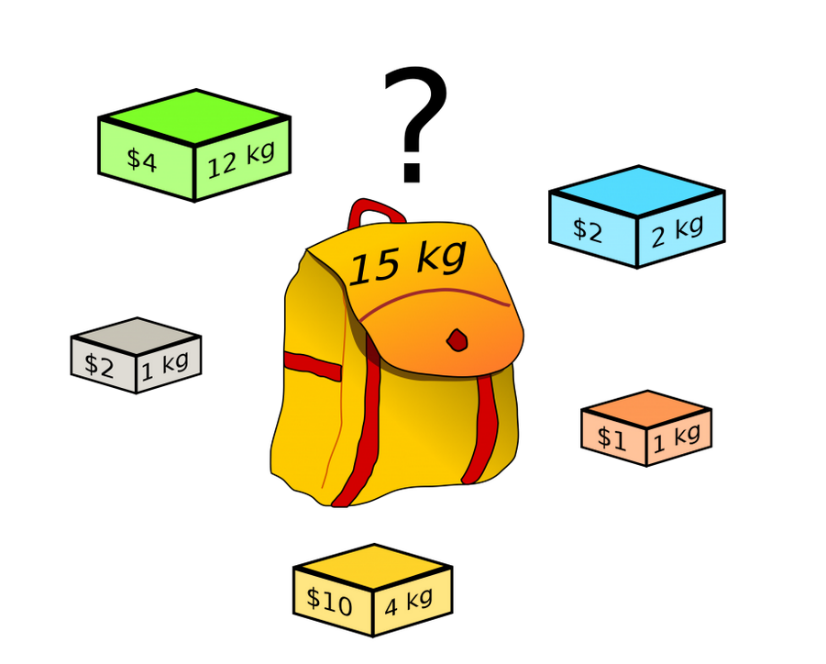
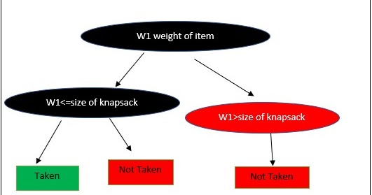

**0-1 Knapsack Problem**

**مسئله باینری کوله پشتی:**

مسئله کوله پشتی یا Knapsack یک مسئله کلاسیک برای بهینه سازی است که با حل آن میتوان مسائل مشابه دنیای واقعی را نیز حل کرد. به همین دلیل حل [مسئله کوله پشتی](http://matlab24.ir/knapsack) در هوش مصنوعی زیاد مورد توجه قرار گرفته است.

بهترین کار هنگام حل یک چالش مسئله این است که ابتدا ساده سازی کنیم و بعد فرموله بندی کنیم تا بتوانیم مسئله را به بهترین شکل حل کنیم.

مجموعه ای از وسایل داریم که آنها را با اعداد 0 تا n-1 شماره گذاری میکنیم. هر کدام از این وسایل وزن خاص خود را دارد که وزن آنها را با w0 تا wn-1  نمایش میدهیم. هر کدام از وسایل، ارزش خاص خود را دارد که ارزش اشیاء را با v0 تا vn-1  نشان میدهیم. پس شیء شماره 0 دارای وزن w0 و دارای ارزش v0 میباشد. شیء شماره 1 دارای وزن w1 و دارای ارزش v1 میباشد و در نهایت شیء شماره n-1  دارای وزن wn-1 و دارای ارزش vn-1 میباشد.

def knapSack(W, wt, val, n):

` `# Base Case

`    `if n == 0 or W == 0:

`        `return 0

` `if (wt[n - 1] > W)

`        `return knapSack(W, wt, val, n - 1);

else:

`        `return max(

`            `val[n-1] + knapSack(

`                `W-wt[n-1], wt, val, n-1),

`            `knapSack(W, wt, val, n-1))

// Driver code

int main()

{

`    `int val[] = { 60, 100, 120 };

`    `int wt[] = { 10, 20, 30 };

`    `int W = 50;

`    `int n = sizeof(val) / sizeof(val[0]);

`    `cout << knapSack(W, wt, val, n);

`    `return 0;

}

wt[] = {1, 1, 1}, W = 2, val[] = {10, 20, 30}

`                       `K(n, W)

`                       `K(3, 2)  

`                   `/            \ 

`                 `/                \               

`            `K(2, 2)                  K(2, 1)

`          `/       \                  /    \ 

`        `/           \              /        \

`       `K(1, 2)      K(1, 1)        K(1, 1)     K(1, 0)

`       `/  \         /   \              /        \

`     `/      \     /       \          /            \

K(0, 2)  K(0, 1)  K(0, 1)  K(0, 0)  K(0, 1)   K(0, 0)

پیچیدگی الگوریتم از مرتبه O(n2) است. 

