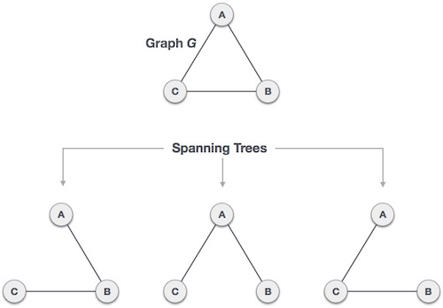

<h1>درخت پوشای کمینه (MST)</h1>
<h2>درخت پوشا چیست؟</h2>

در ابتدا و قبل از معرفی درخت پوشای کمینه بهتر است با درخت پوشا آشنا شویم.
اگر گرافی ب نام  G داشته باشیم؛ آنگاه درخت پوشا زیرمجموعه‌ای از گراف G است که همه رئوس آن با کمترین مقدار یال‌های ممکن پوشش یافته باشد. همچنین باید اشاره کرد که درخت پوشا دور ندارد و هیچ رأس ناهمبندی در آن دیده نمی‌شود.

<h2>تعریف درخت پوشای کمینه (MST)</h2>

در یک گراف وزن‌دار، درخت پوشای کمینه (Minimum spanning tree)، آن درخت پوشایی است که کمترین وزن را نسبت به دیگر درخت‌های پوشای همان گراف داشته باشد.  در موقعیت‌های دنیای واقعی این وزن می‌تواند بر اساس مسافت، ازدحام، بار ترافیکی، یا هر مقدار دلخواهی که به یال‌ها اختصاص می‌یابد اندازه‌گیری شود.

<h3>مهم ترین الگوریتم های درخت پوشای کمینه</h3>
<ul>
<li>الگوریتم کروسکال</li>

 این الگوریتم برای یافتن درخت پوشای با کمترین هزینه از رویکرد حریصانه بهره می‌گیرد.در واقع این الگوریتم با گراف به صورت یک جنگل برخورد می‌کند که در آن هر گره یک درخت منفرد محسوب می‌شود. یک درخت زمانی به درخت دیگر وصل می‌شود اگر و فقط اگر در میان همه گزینه‌های موجود، کمترین هزینه را داشته باشد و مشخصات درخت پوشای کمینه (MST) را نیز نقض نکند.

<h3>شبه کد:</h3>

<pre>
<code>
class Graph:

    def__init__(self,vertices):

        self.V=vertices

        self.graph=[]

    def addEdge(self,u,v,w):

        self.graph.append([u,v,w])

    def find(self,parent,i):

        if(parent[i]==i):

            return i

        return self.find(parent, parent[i])

    def union(self,parent,rank,x,y):

        xroot=self.find(parent,x)

        yroot=self.find(parent,y)

        if(rank[xroot] < rank[yroot]):

            parent[xroot] = yroot

        elif(rank[xroot] > rank[yroot]):

            parent[yroot] = xroot

        else:

            parent[yroot] = xroot

            rank[xroot] += 1

    def KruskalMST(self):

        result = []

        i=0

        e=0

        self.graph = sorted(self.graph,key=lambda item:item[2])

        parent,rank = [],[]

        for node in range(self.V):

            parent.append(node)

            rank.append(0)

        while(e < self.V-1):

            u,v,w = self.graph[i]

            i+=1

            x = self.find(parent, u)

            y = self.find(parent, v)

            if(x != y):

                e+=1

                result.append([u,v,w])

                self.union(parent, rank, x, y)

        print("Following are the edges in the constructed MST")

        for u,v,weight in result:

            print("%d -- %d == %d" %(u,v,weight))

g = Graph(4)

g.addEdge(0,1,10)

g.addEdge(0,2,6)

g.addEdge(0,3,5)

g.addEdge(1,3,15)

g.addEdge(2,3,4)

g.KruskalMST()     

Output :
Following are the edges in the constructed MST:

2 -- 3 == 4
0 -- 3 == 5
0 -- 1 == 10
</code>
</pre>

<li>الگوریتم پریم</li>

الگوریتم پریم برای یافتن درخت پوشای با کمترین هزینه (همانند الگوریتم کروسکال که در بخش قبل بررسی کردیم) از رویکرد حریصانه بهره می‌گیرد. الگوریتم پریم شباهت‌هایی با الگوریتم‌های «کوتاه‌ترین مسیر، اول» (shortest path first) دارد.

الگوریتم پریم در تضاد با الگوریتم کروسکال است، چون با گره‌ها به عنوان یک درخت منفرد برخورد می‌کند و به افزودن گره‌ها به یک درخت پوشا از گراف مفروض ادامه می‌دهد.

<h3>شبه کد:</h3>

<pre>
<code>
def createAdjMatrix(V, G):
    adjMatrix = []
    #create N x N matrix filled with 0 edge weights between all vertices
    for i in range(0, V):
        adjMatrix.append([])
        for j in range(0, V):
            adjMatrix[i].append(0)
    #populate adjacency matrix with correct edge weights
    for i in range(0, len(G)):
        adjMatrix[G[i][0]][G[i][1]] = G[i][2]
        adjMatrix[G[i][1]][G[i][0]] = G[i][2]
    return adjMatrix
def prims(V, G):
    # create adj matrix from graph
    adjMatrix = createAdjMatrix(V, G)
    #arbitrarily choose initial vertex from graph
    vertex = 0
    #initialize empty edges array and empty MST
    MST = []
    edges = []
    visited = []
    minEdge = [None,None,float('inf')]
    #run prims algorithm until we create an MST
    #that contains every vertex from the graph
    while len(MST) != V-1:
        #mark this vertex as visited
        visited.append(vertex)
        #add each edge to list of potential edges
        for r in range(0, V):
            if adjMatrix[vertex][r] != 0:
                edges.append([vertex,r,adjMatrix[vertex][r]])
        #find edge with the smallest weight to a vertex
        #that has not yet been visited
        for e in range(0, len(edges)):
            if edges[e][2] < minEdge[2] and edges[e][1] not in visited:
                minEdge = edges[e]
        #remove min weight edge from list of edges
        edges.remove(minEdge)
        #push min edge to MST
        MST.append(minEdge)
        #start at new vertex and reset min edge
        vertex = minEdge[1]
        minEdge = [None,None,float('inf')]
    return MST
#graph vertices are actually represented as numbers
#like so: 0, 1, 2, ... V-1
a, b, c, d, e, f = 0, 1, 2, 3, 4, 5
#graph edges with weights
#diagram of graph is shown above
graph = [[a,b,2],
        [a,c,3],
        [b,d,3],
        [b,c,5],
        [b,e,4],
        [c,e,4],
        [d,e,2],
        [d,f,3],
        [e,f,5]]
#pass the # of vertices and the graph to run prims algorithm 
print(prims(6, graph))

Output:
    [[0, 1, 2], [0, 2, 3], [1, 3, 3], [3, 4, 2], [3, 5, 3]]
</code>
</pre>
</ul>

