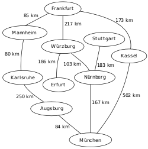

<h1 dir="rtl">Breadth-First Search (DFS)</h1>
 <h3 dir="rtl">معرفی</h3>
این الگوریتم جستجو در گراف ها و درخت ها کاربرد دارد. در این الگوریتم تمامی داده ها تا زمان پیدا شدن مقدار مورد نظر مورد بررسی قرار می گیرند. در این روند بررسی وسعت ارتباطات در هر مرحله نسبت به عمق آن الویت بیشتری دارد به صورتی که در هر مرحله تمامی زیر مجموعه های لایه اول یک مورد بررسی شده و در صورت یافت نشدن مقدار مورد نظر به بررسی زیر شاخه های بعدی پرداخته می شود. این روند بر خلاف الگوریتم <a href="../DFS/DFS.md"> Breadth-first search (BFS)</a> است.
در تصویر زیر عملکرد این الگوریتم در یک درخت به خوبی مشاهده می شود. در گراف ها نیز بخاطر احتمال وجود دور و جلوگیری از بیش از یک بار بررسی شدن یک گره هر گره را بعد بررسی علامت گذاری می کنیم.

<h3 dir="rtl">ویژگی ها</h3>
 آنالیز فضا و زمان این الگوریتم نشان می دهد که از <b>O(|V|+|E|)</b> هست که <b>V</b> تعداد گره های گراف یا درخت و <b>E</b> تعداد یال هاست. و از نظر ذخیره فضا هم از <b>O(|V|)</b> است.
 از نظر تئوری پیچیدگی زمانی و فضایی این الگوریتم با DFS برابر است اما نکته ای که وجود دارد که در DFS به دلیل جستجوی هر شاخه تا به انتها و سپس سر زدن به شاخه های دیگر، احتمال گم شدن بخصوص در ساختارهای بی نهایت مانند داده ها و شبکه های مورد استفاده در هوش مصنوعی وجود دارد. اما با استفاده از BFS تضمین می شود که جواب در کوتاه ترین مسیر پیدا شود.
به عنوان مثال تصویر زیر (سمت راست) نقشه ارتباطی بین چند شهر آلمان را نشان می دهد و درخت BFS ارتباطات شهر فرانکفورت کوتاه ترین مسیرها را به شهرهای قابل دسترس نشان می دهد.
 
 <h3 dir="rtl">شبه کد</h3>
 در این تابع یک گراف و یک گره به نام root از آن را گرفته تمامی گره هایی که به گره اولی راه دارند را بر اساس کمترین فاصله بر میگرداند.

    procedure BFS(G, root) is
        let Q be a queue
        label root as explored
        Q.enqueue(root)
        while Q is not empty do
            v := Q.dequeue()
            if v is the goal then
                return v
            for all edges from v to w in G.adjacentEdges(v) do
                if w is not labeled as explored then
                    label w as explored
                    Q.enqueue(w)

این الگوریتم در فایل BFS.py پیاده سازی شده است.
<h1> کاربردها</h1>
<ul>
<li>استفاده در کپی کردن مجموعه های بازیافتی (garbage collection)</li>
<li>یافتن کوتاه ترین مسیر بین دو گره یک گراف یا درخت</li>
<li>نامگذاری شبکه در Cuthill–McKee</li>
<li>یافتن دبی بیشینه در دبی جریان شبکه به روش Ford–Fulkerson</li>
<li>ایجاد کلاستر و محاسبات موازی در الگوریتم های موازی</li>
</ul>

