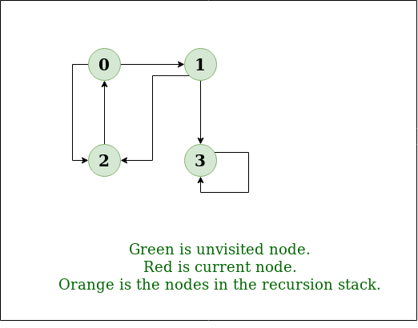
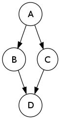

<h1 dir="rtl">Depth-first search (DFS)</h1>
 <h3 dir="rtl">معرفی</h3>
این الگوریتم جستجو در گراف ها و درخت ها کاربرد دارد. در این الگوریتم تمامی داده ها تا زمان پیدا شدن مقدار مورد نظر مورد بررسی قرار می گیرند. در این روند بررسی عمق ارتباطات نسبت به وسعت آن الویت بیشتری دارد به صورتی که ابتدا تمامی زیر مجموعه های یک مورد بررسی شده و در صورت یافت نشدن مقدار مورد نظر به شاخه بعدی می رود که این روند بر خلاف الگوریتم <a href="../BFS/BFS.md#breadth-first-search-bfs"> Breadth-first search (BFS)</a> است.

به صورت ساده می توان این الگوریتم را به این صورت تعریف کرد که در هر گره از گراف یا درخت تمامی زیر شاخه هارا در یک استک ریخته و سپس به اولین آن رفته و این کار را ادامه می دهد تا که به مقدار مورد نظر برسد و یا که آن شاخه به انتها برسد. در حالت دوم با استفاده از داده های ذخیره شده در استک خود، به آخرین گره دارای زیر شاخه بررسی نشده برگشته و آن را تا انتها پیمایش می کند. در شکل زیر شماتیک این روند برای یک درخت و یک گراف نمایش داده شده است.

  

 <h3 dir="rtl">ویژگی ها</h3>
 آنالیز فضا و زمان این الگوریتم نشان می دهد که از <b>O(|V|+|E|)</b> هست که <b>V</b> تعداد گره های گراف یا درخت و <b>E</b> تعداد یال هاست. و از نظر ذخیره فضا هم از <b>O(|V|)</b> هست که در بدترین حالت بایستی تمامی گره هارو بخاطر سپرده تا بتواند به آخرین گره رسیده و بازگردد.
 از نظر تئوری پیچیدگی زمانی و فضایی این الگوریتم با BFS برابر است اما نکته ای که وجود دارد در مسائلی مثل یافتن راه حل در کدهای هوش مصنوعی و یا صفحات وب که امکان وجود عمق های بسیار زیادی در داده ها وجود دارد و در مواردی احتمال عمق بینهایت برای بعضی شاخه ها هست استفاده از DFS امکان پذیر نیست و یا اینکه بایستی یک قید برای جستجوی عمق تا تعداد مشخصی زیر شاخه را برای الگوریتم در نظر گرفت.
 <h3 dir="rtl"> مرتب سازی با استفاده از DFS</h3>
 با استفاده از این الگوریتم درخت ها و گراف هارا می توان بر اساس ترتیبی که گره ها در روند الگوریتم DFS بازدید می شوند به صورت یکی از چهار دسته زیر مرتب کرد:
 <ul>
 <li><b> preordering </b> که گره ها به ترتیب ابتدا به انتهایی که در الگوریتم بازدید می شوند مرتب می شوند.</li>
 <li><b> postordering </b> که گره ها به ترتیب از آخرین گره ای که بازدید شده به گره ابتدایی مرتب می شوند.</li>
 <li><b> reverse preordering </b> در این روش ترتیب انتخاب گره در هر مرتبه معکوس شده و باز گره ها به ترتیب بازدید از ابتدا به انتها مرتب می شوند و این روش با postordering متفاوت است.</li>
 <li><b> reverse postordering </b> این جا نیز ترتیب انتخاب در هر مرحله معکوس شده و دوباره مانند postordering گره های بازدید شده (باالگوریتم معکوس) از آخرین گره به اولین مرتب می شوند و بدیهی است که لیست بدست آمده با preordering متفاوت است.</li>
<li>برای درخت های دودویی دو حالت in-ordering و reverse in-ordering نیز وجود دارد</li>
 </ul>
 به طور مثال براساس گراف زیر و این فرض که در الگوریتم DFS استفاده شده الویت از چپ به راست است، نتیجه هر یک از مرتب سازی ها ارائه شده است.
 

 <table>
 <td></td>
 <td>
 <table>
  <tr>
   <th>نتیجه</th>
   <th>روش مرتب سازی</th>
  </tr>
  <tr>
    <td>ABCD</td>
    <td>preordering</td>
  </tr>
  <tr>
    <td>DCBA</td>
    <td>postordering</td>
  </tr>
  <tr>
    <td>ACBD</td>
    <td>reverse preordering</td>
  </tr>
  <tr>
    <td>DBCA</td>
    <td>reverse postordering</td>
  </tr>
</table>
  </td>
 </table>

 <h3 dir="rtl">شبه کد</h3>
 در این تابع یک گراف و یک گره از آن را گرفته و به صورت بازگشتی تمامی گره هایی که به گره اولی راه دارند را بر میگرداند.

    procedure DFS(G, v) is
        label v as discovered
        for all directed edges from v to w that are in G.adjacentEdges(v) do
            if vertex w is not labeled as discovered then
                recursively call DFS(G, w)

 در فایل DFS.py این الگوریتم در زبان پایتون پیاده سازی شده است.
<h1> کاربردها</h1>
<ul>
<li>پیدا کردن دور (cycle) در گراف</li>
<li>پیدا کردن مسیر در گراف ها. البته این الگوریتم الزامن کوتاه ترین مسیر را پیدا نمی کند و برای پیدا کردن کوتاه ترین مسیر الگوریتم BFS عملکرد مناسب تری دارد</li>
<li>مرتب سازی توپولوژیک که در برنامه ریزی های وظایف وابسته و دارای زیر مجموعه استفاده می شود.</li>
<li>تایید اتصال قوی داشتن یک گراف [یک گراف زمانی دارای اتصال قوی است که هر یک از گره های آن به تمامی دیگر گره های گراف متصل باشد]</li>
</ul>

